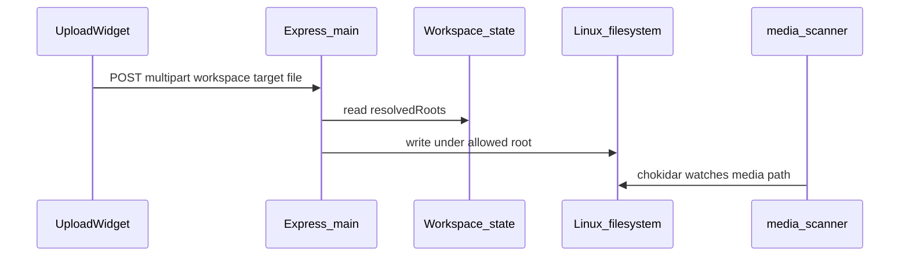

# Caspar media — architecture

## Upload sequence

1. **Settings (plugin worker)**  
   User saves `casparConfigPath`. The plugin parses `casparcg.config` and writes **`plugins.bridge-plugin-caspar-media.settings`** (including `resolvedRoots`).

2. **Upload (main process)**  
   - **Simple:** `POST /api/v1/workspaces/:workspace/caspar-media/upload` with **multer** (temp file → move). The upload widget uses **XMLHttpRequest** so the browser can report **upload progress**.  
   - **Large files (≥ 50 MiB in the widget):** **chunked** flow — `upload/init` → repeated `upload/chunk` (raw body) → `upload/complete`; optional `upload/status` for resume, `upload/cancel` to abandon. **Pause** in the UI stops sending the next chunk; **resume** continues from `status`. A single aborted multipart POST is **not** resumable.

3. **Delete (main process)**  
   `POST /api/v1/workspaces/:workspace/caspar-media/delete` with JSON `{ target, logicalName }` (Caspar CLS/TLS name). The server resolves **one** filesystem file under the chosen root using **case-insensitive** path matching (exact relative path or `logicalName` + extension). **404** if none, **409** if ambiguous (multiple matches).

4. **Library (widget)**  
   Uses `caspar.sendCommand` for `cls` / `tls` like the stock Caspar library. Server list is read from **`plugins.bridge-plugin-caspar.servers`** via `CasparServerSelector`. **Delete** calls the delete API and bumps **refresh** so the list refetches.

5. **Workspace id in iframes**  
   Widgets load from `/api/v1/serve/...`; use **`state._id`** (not only `window.APP.workspace`) for upload `fetch` URLs.

### Why “I’m in a workspace” can still return `ERR_CASPAR_MEDIA_NOT_CONFIGURED`

Opening `/workspaces/:id` only identifies the workspace. **Library browsing** uses AMCP on the Caspar server and does not need local disk paths. **Delete** and **upload** HTTP routes read **`plugins.bridge-plugin-caspar-media.settings.resolvedRoots`** from workspace state on the **Bridge server** (parsed from `casparcg.config`). Until that settings frame has been saved successfully, those routes return **400** with a message that may include **`parseError`** from the last failed parse.

## Migration from `bridge-plugin-media-upload`

On activate, if **`plugins.bridge-plugin-caspar-media.settings`** is missing but **`plugins.bridge-plugin-media-upload.settings`** exists, settings are copied with `$replace` and the legacy plugin key is removed (`$delete`).

## Workspace state

| Path | Type | Description |
|------|------|-------------|
| `plugins.bridge-plugin-caspar-media.settings.casparConfigPath` | `string` | Absolute path to `casparcg.config`. |
| `plugins.bridge-plugin-caspar-media.settings.resolvedRoots` | `object` | `{ media?, template?, font? }` absolute directory paths. |
| `plugins.bridge-plugin-caspar-media.settings.parseError` | `string \| null` | Set when parsing fails. |
| `plugins.bridge-plugin-caspar-media.settings.lastParsedAt` | `number` | Unix ms when paths were last parsed successfully. |

Use **`$replace`** for the whole `settings` object when applying patches that include `null` fields (see Bridge `shared/merge.js` / `typeof null`).

## HTTP API

**`POST /api/v1/workspaces/:workspace/caspar-media/upload`**

- **Content-Type:** `multipart/form-data`
- **Fields:** `file`, `target` (`media` \| `template` \| `font`), optional `relativePath`.

Implementation: [`lib/routes/casparMedia.js`](../../lib/routes/casparMedia.js).

**Responses:** `200` success JSON; `400` / `404` / `413` / `500` as documented previously for the upload flow.

**Limits:** max file size **2 GiB** (simple multipart and chunked `fileSize`).

---

**`POST /api/v1/workspaces/:workspace/caspar-media/delete`**

- **Content-Type:** `application/json`
- **Body:** `target` (`media` \| `template` \| `font`), `logicalName` (or `relativePath`) — Caspar logical path as returned by CLS/TLS, POSIX-style, no `..`.
- **Resolution:** scans files under the target root; a match is either the same relative path (ignoring **case**, so Caspar’s CLS/TLS casing can differ from the disk) or any file whose path is `logicalName` + `.ext` (also case-insensitive). The file actually deleted is always the **on-disk** path. **404** if no file, **409** if more than one match (e.g. ambiguous duplicates or two paths that differ only by case on a case-sensitive filesystem).

---

**Chunked upload** (same `resolvedRoots` / path rules as simple upload; in-memory session + temp `.part` file; **24 h TTL**, cleaned on new `init` and when sessions expire):

| Method | Path | Notes |
|--------|------|--------|
| `POST` | `.../caspar-media/upload/init` | JSON: `fileName`, `fileSize`, `target`, optional `relativePath` → `{ uploadId, chunkSize }` (chunk size **8 MiB**). |
| `GET` | `.../caspar-media/upload/status?uploadId=` | `{ receivedBytes, fileSize, chunkSize }`. Truncates a partial last chunk to the previous full chunk boundary so resume stays aligned. |
| `POST` | `.../caspar-media/upload/chunk?uploadId=&chunkIndex=` | **Body:** raw `application/octet-stream`. Chunks must arrive in order at `chunkIndex * chunkSize` offsets. |
| `POST` | `.../caspar-media/upload/complete` | JSON: `{ uploadId }` — verifies size, renames part file to final destination. |
| `POST` | `.../caspar-media/upload/cancel` | JSON: `{ uploadId }` — removes session and temp file (idempotent if unknown). |

## Path safety

Same as before: `path.resolve` + prefix check under root; reject `..` in relative path; basename-only for uploaded filename.

## Plugin commands (worker)

| Command | Purpose |
|---------|---------|
| `casparMedia.saveSettings` | `{ casparConfigPath }` — parse config, update `resolvedRoots`. |
| `casparMedia.refreshPaths` | Re-parse using current `casparConfigPath`. |

## Widget IDs

| ID | `?path=` |
|----|----------|
| `bridge.plugins.caspar-media.library` | `library` |
| `bridge.plugins.caspar-media.upload` | `upload` |

Settings frame: `settings/config`.

## Security notes

Upload endpoint exposure matches other `/api/v1` routes; restrict network access as needed.

## Extension points

- **AMCP / Caspar refresh** after delete or upload (operators may still need to refresh Caspar’s cache depending on version).
- Per-machine profiles; alternative chunk sizes or persistent session store across process restarts.
